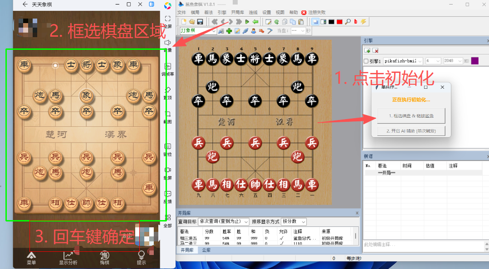
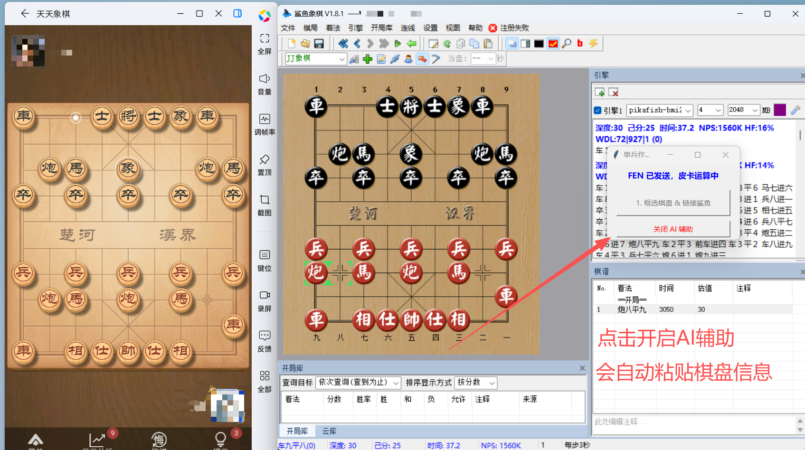
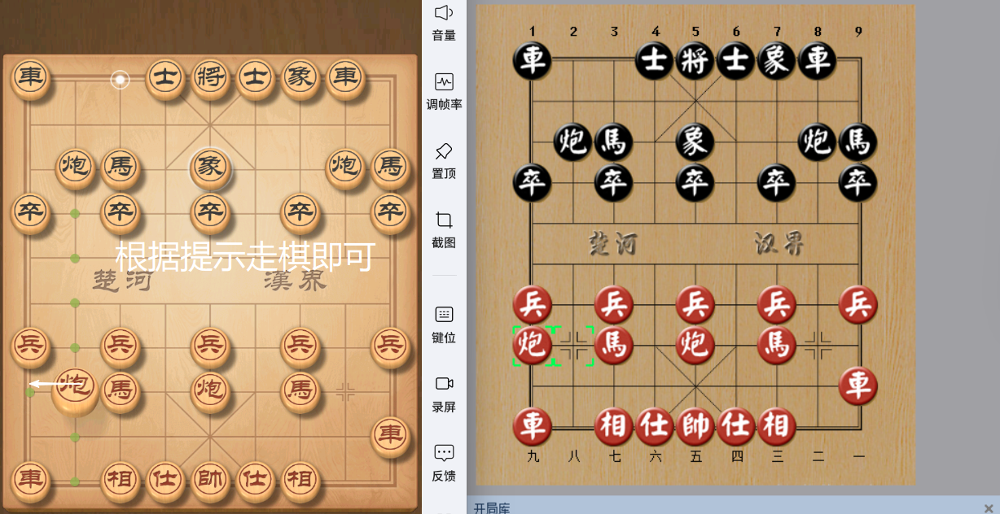

# chess-pika-shark

一个象棋辅助分析工具，能自动识别棋盘并传递给 AI 引擎分析。

## 项目简介

chess-pika-shark 是一个集成了棋盘识别、AI引擎调用和自动化控制的象棋辅助工具。通过截图识别棋盘状态，自动将棋局信息传递给鲨鱼象棋进行AI分析，帮助用户学习和提升棋艺。

**核心功能：**
- 🎯 自动识别棋盘状态
- 🤖 集成皮卡鱼引擎进行深度分析
- 🔄 自动传递棋局信息到鲨鱼象棋
- 📊 实时显示AI分析结果

## 致谢

部分开发思路参考了 [xiangqi-analysis](https://github.com/chengstone/xiangqi-analysis) 项目，特此感谢。

## 环境要求

### 前置软件
- 腾讯天天象棋
- 鲨鱼象棋 v1.8.1
- 皮卡鱼引擎 exe （可选）

### Python 依赖
- 完整依赖见 `requirements.txt`

## 快速开始

### 1. 克隆项目

```bash
git clone https://github.com/yourusername/chess-pika-shark.git
cd .\chess-pika-shark\PikaShark
```

### 2. 安装依赖

```bash
pip install -r requirements.txt
```

### 3. 运行程序

```bash
python pika.py
```

## 使用方法

### 步骤1：初始化棋盘区域

首次运行需要框选棋盘区域：

1. 启动程序后点击"初始化"按钮
2. 用鼠标框选整个棋盘区域
3. 确保框选范围包含完整棋盘



### 步骤2：开始 AI 分析

1. 轮到己方走棋时，点击"开始AI分析"按钮
2. 程序会自动识别当前棋盘状态
3. 识别结果显示在界面上



### 步骤3：传递棋局信息

1. 点击"传递AI棋盘信息"按钮
2. 程序自动打开鲨鱼象棋并设置棋盘
3. 查看 AI 推荐的走法



## 注意事项

1. 请在己方走棋回合时执行 AI 分析
2. 框选棋盘时包含整个棋盘即可，不要过多或过少
3. 尽量将应用放在白色背景上，提高识别准确率
4. 少数情况可能识别错误，可在鲨鱼象棋中手动修改
5. 框选棋盘后不要移动棋盘窗口位置

## 项目结构

```
chess-pika-shark/
├── PiKaShark/              # 主项目代码
├── chess_vision/           # 识别算法
├── test_chess_vision/      # 识别算法测试
├── test_shark_gui/         # 鲨鱼象棋控制模块
├── README.md
├── requirements.txt
└── docs/
    └── images/
```

## 技术特点

识别算法基于棋盘颜色提取，通过 HSV 色彩空间分割和形态学处理来识别棋子。自动化部分用 UI Automation 控制鲨鱼象棋窗口，FEN 码转换后直接设置棋盘。

## 开发状态

当前版本：v1.0.0

已实现功能：
- 棋盘区域框选和保存
- 棋盘自动识别
- 棋子颜色和类型识别
- FEN 码生成
- 鲨鱼象棋窗口控制

已知问题：
- 少数情况下可能出现棋子识别错误
- 光照条件变化可能影响识别准确率

## 后续开发计划

短期计划（我要用）：
- 棋盘实时动态检测，识别对方走子后自动传递给 AI
- 自动走子功能
- 优化黑色棋子识别算法
- 添加几个按钮让操作更人性化

长期计划（画饼）：
- 支持更多象棋对局软件
- 开发AI引擎调用软件，实现更多功能（比如棋局演化可视化界面）
- 支持手机端使用

## 常见问题

**Q: 识别不准确怎么办？**

检查棋盘框选是否准确，将应用放在白色背景上，确保光照充足。如仍有问题可在鲨鱼象棋中手动修正。

**Q: 程序无法找到鲨鱼象棋窗口？**

确保鲨鱼象棋已启动，窗口标题为"鲨鱼象棋"。

**Q: 支持哪些象棋软件？**

当前版本主要支持腾讯天天象棋，后续版本会支持更多。

**Q: 可以用于实战对局吗？**

本工具仅供学习和研究使用，请勿用于在线对局。

## 贡献指南

欢迎提交 Issue 和 Pull Request。

开发环境设置：

```bash
git clone https://github.com/yourusername/chess-pika-shark.git
cd chess-pika-shark
python -m venv venv
source venv/bin/activate  # Windows: venv\Scripts\activate
pip install -r requirements.txt
```

代码规范：
- 遵循 PEP 8 代码风格
- 添加必要的注释
- 提交前运行测试

## 许可证

MIT 许可证，详见 LICENSE 文件。

## 免责声明

本工具仅供学习和研究使用。请勿用于在线对局，尊重对手，享受象棋的乐趣。

---

如果这个项目对你有帮助，欢迎 Star 支持。
